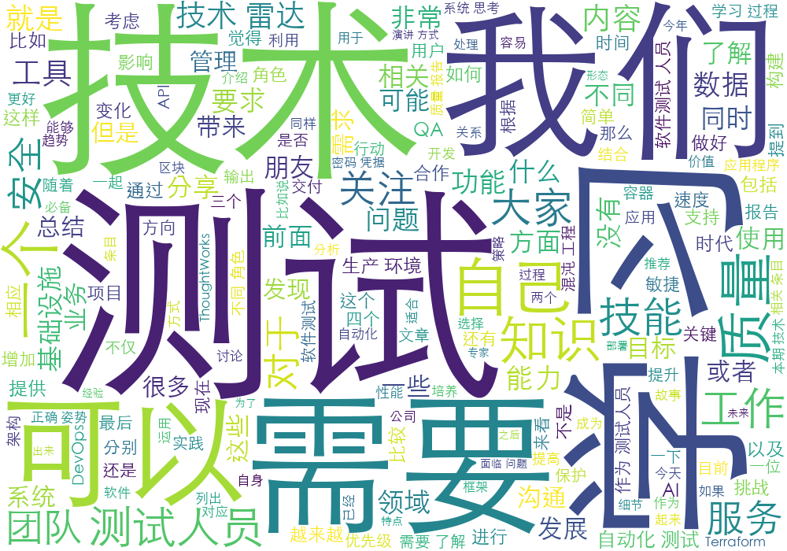

## 软件测试人员该何去何从？



## 测试人员面临的问题

- 多年重复手动测试，只关注自己手头上的事情，跟别的团队较少沟通，相对比较封闭。有很多人觉得自己“能力够用”就行，舒适区过着很爽，很自然就没有学习提高的动力。
- 应变能力越来越弱，随着年龄的增长，除了重复积累的经验，并没有同步增长你的技能。外界传递给你的压力可能越来越大了，身份转变了，上有老下有小，家庭的压力会导致你能用于技能提升的精力更少，更加难以提高。
- 得不到技能的提高，在团队的影响力减小，话语权降低，不被重视，甚至自己都会怀疑自己的价值。（转岗，或者换行业-不是说这样不好，而是这到底是不是你逃避呢）

## 推荐《World Quality Report》

Capgemini、Micro Focus 和 Sogeti 联合组织问卷调查，每年出具一份《World Quality Report》（全球质量报告）

> 报告列出了大家关注的质量趋势，也对应给出了推荐的做法。

作者有之前的报告有文章进行了解读，有兴趣的可以仔细品读（欢迎大家一起学习和交流）。《[数字化时代的软件测试](https://www.bylinzi.com/2018/07/09/new-software-testing/)》和《[关于质量，大家都在关注什么](https://www.bylinzi.com/2019/05/21/world-quality-report-2018-19/)》。

### 今年的报告给我们带来了什么？

> 功能是软件系统中最为核心的内容，但是只有功能是远远不够的。在功能的外层还有更高的质量目标。

最高质量的四个目标：

- 安全
  - 不仅包括应用程序自身的安全、对用户隐私的保护。
  - 还包括软件开发过程中的安全和软件资产的安全管理。
- 速度
  - 应用程序本身的性能
  - 交付的速度，从idea到成品交付到用户手里越快越好（抢占先机！）
- 便利性
  - 应用程序究竟解决用户的什么问题，给用户提供多大的便利程度？
- 体验
  - 易用性
  - 页面布局和配色等


随着质量要求的提高，软件测试也不再是发现缺陷那么简单，对我们的测试人员的要求也有更大的变化。


### 行动起来

#### 01. 学习

大家在学习的时候一定会面临的问题：

- 技术日新月异，太多的东西要学了，我基础这么差，我该从何学起呢？

> 现在的时代，学习渠道、学习内容都是无穷的，学习的困难不是学习资源，而是甄别哪一个值得学习。（给学习提高了更高的门槛，这也使得有部分人无从下手，困难就干脆不学了）

- 不知道从哪学起，那就先学一个东西再说，学了总比没学好？

> 这种方法在知识匮乏的时代是可取的。但是现在就不是这样了。
>
> 人的精力是有限的，应该学习对我们有价值，有用的。

- 目的性不强，学到了零散的知识，很难真正派上用场，最后它也会被遗忘。

> 可能很多 QA 都在啃次啃次的学 Python，自动化脚本必备嘛，不学一下就觉得自己落伍了。（可是学以不致用，那还不如不学，因为时间是你的敌人。）
>
> 反复几次之后，将会严重影响你的学习积极性。

#### 那我们究竟应该怎么学呢？

##### 学习的过程

从海量的知识中挑选自己需要的部分，进行加工和提炼，变成自己掌握的知识。

> 最关键的是将学到的知识应用到不同的领域，或者总结分享出来供他人学习和使用。


完整学习过程：**知识输入、加工提炼、知识输出**。


问大家一个问题：平常大家是如何定义读完了某本书？（学习完了某个视频）

？

必须有输出，输出方式：

+ 写读书笔记；
+ 提炼书中观点，结合自己的经验总结成博客文章；
+ 运用书中理论到工作实践中，在团队中分享；
+ 以演讲的方式到大会上分享给更多的人；


不断反复学习+总结+分享=某技术领域的专家


##### 学习的正确姿势

两个关键步骤：

- 目标驱动，以始为终：搞清楚我们要把学习到的知识应用到哪里？（学习目标）

> 搞清楚3个问题：
>
> - Why - 为什么要学？输出是什么？
> - What - 要学什么内容？输入是什么？
> - How - 如何学？学习的方式，对于不同的内容需要采用不同的学习方式。


那是不是就学习我们工作所需就够了呢？肯定不是，我们得提升自己。

我们先来看一个**T 型能力模型**提升自己的能力。


T 的横表示能力广度（拓宽视野，更多领域知识），T 的竖表示能力深度。

> 我们应该结合自己的兴趣特点，找到最适合自己的那个领域，深入发展。
>
> 通过实践将知识转换为经验，总结归纳、不断锻炼，以获得利用经验解决问题的能力，拥有一技之长。


##### 学习的方向指导

- 趋势性内容推荐一：全球质量报告就是一份很好的趋势方面的内容

质量报告提到让大家关注质量趋势的5个方面：AI 和测试、敏捷和 DevOps、测试自动化、环境和数据，以及质量保障方面的成本投入问题。

质量工程技能策略：


- 趋势性内容推荐二：ThoughtWorks 技术雷达


- 关注技术社区，技术大会，技术类公众号。（了解别人都在做什么，别做井底之蛙，多交流，多分享）

#### 02. 沟通

光闷头苦学是不可以的，要想职业生涯更顺畅，一定要增加跟别人的沟通。

- 项目团队内跟不同的角色沟通。

  - 团队为质量负责，但是不同角色对质量的理解可能不够透彻，对质量的关注不够，QA 需要承担起质量协调者的角色。（将我们对于质量的理解、质量状态及时的跟团队反馈，真正做到团队为质量负责。）
  - 跟不同角色的合作过程中，可以从对方角色学到自身欠缺的技能，也可以让对方从你身上学习到测试考虑的角度。（做的好，是可以双赢的）

- ​	更大范围的沟通

  - 技术社区
  - 其他交流渠道
  - 朋友、同学等

  > 方法：抛出自己的疑问，发表自己的看法。参与群体讨论，可对一些技术文章、所读书籍发表评论、读后感。还可以写文章、演讲来分享自己的经验所得。

#### 03. 突破

测试人员容易抠细节，看不到大局。

- 系统思考

  - 定位问题局限性停留在你发现问题的模块；
  - 比方说我们如何界定一个bug的优先级？

- 扩大视野

  > 见多识广，或许能让你在看待问题时有不同的角度，可以让你提出更有建设性的解决方案。

- 全局观

- 结合自身特点来选择适合自己发展的方向和提升的方法。

  - 兴趣所长
  - 性格特征


林冰玉送大家两句话：

```
选自己所爱，爱自己所选！

坚持就是胜利！
```

### 总结

- 以始为终，持续学习
- 沟通交流，让知识翻倍
- 勇于突破，系统思考
- 选自己所爱，爱自己所选

### 参考资料

1. [BQConf 演讲：软件测试人员该何去何从？](https://www.bylinzi.com/2019/11/25/bqconf-software-qa-how-to-grow/)
2. [软件测试人员的挑战与机遇](https://www.bylinzi.com/2019/06/05/software-testers-challenge-n-chance/)
3. [The 11th edition of World Quality Report 2019-2020 > The future of quality assurance and its role in maximizing growth 全英文 68 页](https://storage.pardot.com/95412/225027/World_Quality_Report_2019_20_e_copy__2_.pdf)

> 以下关键建议将帮助我们加速理解 WQR 2019-2020的质量工程之旅：
>
> 1. 构建一个部署智能分析的智能互联测试生态系统
> 2. 在测试团队中扩展 AI 相关的技能，包括数据科学、统计、数学等等
> 3. 将测试自动化重新想象为一个平台
> 4. 提高对测试环境的认识和可视性；采用卓越中心的方法进行测试数据管理
> 5. 提高游戏的安全性。在设计的生命周期早期引入安全性测试

4. [WQR 2019-2020 美国报告](https://www.capgemini.com/wp-content/uploads/2019/10/WQR-20190-20-North-America.pdf), [WQR 2019-2020 中国报告](https://www.capgemini.com/wp-content/uploads/2019/10/WQR-2019-20-China.pdf)